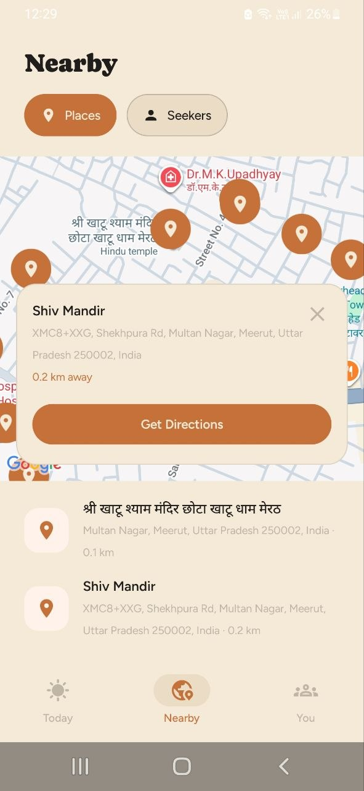
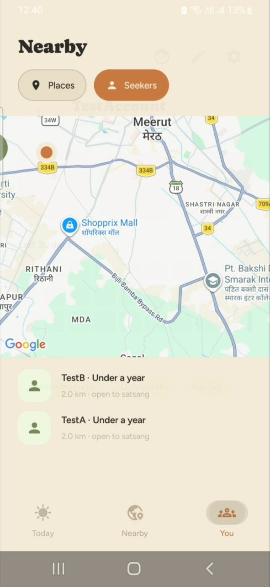
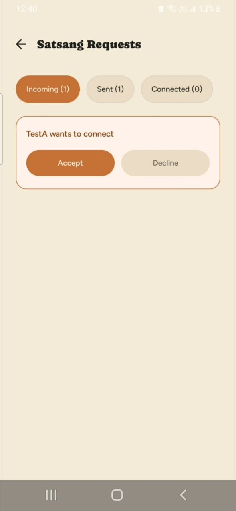
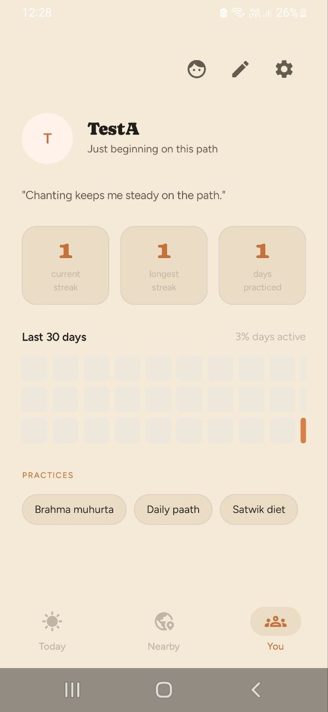
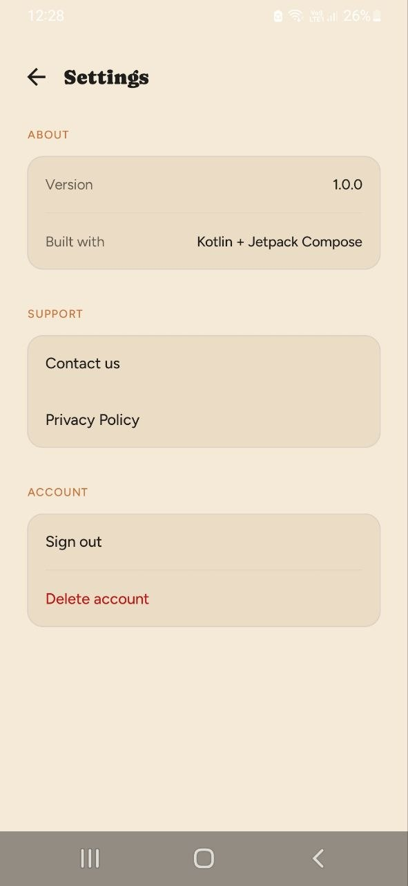

#  MySaarthi

**Walk the Bhagwat Marg, Together**

MySaarthi is built for people walking the Bhagwat Marg — connect with the like-minded people, send and accept connection requests, and find nearby spiritual places with directions. Alongside that, it brings the complete Bhagavad Gita, daily sadhana tracking, reminders, and progress streaks into one place, so your path has both discipline and company.

Currently in **closed testing** on the Google Play Store.

## 📌 Download latest APK

[▶ Click here to download](https://github.com/palaksinghal14/MySaarthi/releases/tag/v1.0.0-closed-test)


## 🎥 Demo Video

📺 Watch the full app walkthrough:

[▶ Click here to watch demo](https://drive.google.com/file/d/17CSLhZgv-aUQvhyuj4eLlBhVrfdI-CBA/view?usp=drivesdk)


---

## 🚀 Features

**Find Fellow Seekers**
Connect with people near you who are walking the same path- send and accept connection request, and build a real community — not just a solo tracker. Turn on "Open to Connect" to become visible to others and discover them too.

**Read the Bhagavad Gita**
Read the complete Gita chapter by chapter, at your own pace, with translations in English and Hindi.

**Daily Practice & Reminders**
Track your daily sadhana and practices, set & get reminders so you never miss a day.

**See Your Progress**
Keep track of your streaks over time — a clear record of how far you've walked on this path.

**Discover Nearby Temples**
Find temples near you with an integrated map.

**Private by Design**
Your exact location is never shared — only an approximate area — and every connection is entirely your choice. Delete your account and data at any time.

---

## 📸 Screenshots

| Nearby Temple                          | Nearby Seeker                         | Connection Request                         |
|----------------------------------------|---------------------------------------|--------------------------------------------|
|  |  |  |  |


| Home                         | Profile                        | Settings                          |
|------------------------------|--------------------------------|-----------------------------------|
|  |  |  |

---

## 🛠 Tech Stack

| Category | Technology |
|----------|------------|
| Language | Kotlin |
| UI | Jetpack Compose + Material 3 |
| Architecture | MVVM + Clean Architecture (domain / data / presentation) |
| State Management | StateFlow + `ViewModel` UI state |
| DI | Hilt (Dagger) |
| Async | Kotlin Coroutines & Flow |
| Navigation | Navigation Compose |
| Local Storage | Room (Gita, Sadhana, and profile data; versioned schema) |
| Backend / Auth | Firebase Authentication, Cloud Firestore |
| Location | Fused Location Provider + GeoFireUtils (privacy-preserving geohash proximity) |
| Scheduling | AlarmManager + BroadcastReceiver |
| Local Preferences | Jetpack DataStore |

---

## 🏗 Architecture

MySaarthi follows **Clean Architecture** with a genuine domain layer separating business logic from both the UI and the data sources:

```
presentation/     UI (Compose screens) + ViewModels
    ↓
domain/           Models, repository interfaces — no Android/Firebase dependencies
    ↓
data/             Repository implementations — Room, Firestore, Location
    ↓
External services (Firebase Auth/Firestore, Fused Location Provider)
```

- **Presentation** — Compose screens per feature, each with a `ViewModel` exposing a single `StateFlow<UiState>`.
- **Domain** — Pure Kotlin models and repository interfaces, with zero Android/Firebase imports.
- **Data** — Repository implementations deciding the actual read/write strategy, including offline-first reads: Room is checked first, Firestore is the fallback on a cache miss, and results are re-cached.
- **Error handling** — A sealed `AppException` hierarchy with one mapper that checks real connectivity before matching exception types.
- **Real-time layer** — Satsang requests/connections are exposed as `Flow`s via `callbackFlow` + Firestore listeners.

---

## 📁 Project Structure

```
app/src/main/java/com/palaksinghal/mysaarthi
│   MainActivity.kt
│   MySaarthiApplication.kt
│
├───core
│   ├───components
│   ├───constants
│   ├───navigation
│   │       MySaarthiApp.kt
│   │       ScreenRoutes.kt
│   │
│   └───utils
│           ExceptionMapper.kt
│           UiState.kt
│
├───data
│   ├───local
│   │   ├───converters
│   │   │       Converters.kt
│   │   │
│   │   ├───dao
│   │   │       SadhanaDao.kt
│   │   │       ShlokaDao.kt
│   │   │       UserProfileDao.kt
│   │   │
│   │   ├───database
│   │   │       GitaDatabase.kt
│   │   │
│   │   ├───datasources
│   │   │       GitaLocalDataSource.kt
│   │   │       UserPreferencesDataSource.kt
│   │   │
│   │   ├───dto
│   │   │       SholkaDto.kt
│   │   │
│   │   └───entity
│   │           SadhanaEntryEntity.kt
│   │           SholkaEntity.kt
│   │           UserProfileEntity.kt
│   │
│   ├───mapper
│   ├───remote
│   └───repository
│           AuthenticationRepoImp.kt
│           LocationRepoImpl.kt
│           NearbyRepositoryImpl.kt
│           SadhanaRepositoryImpl.kt
│           SatsangReqRepoImpl.kt
│           ShlokaRepoImpl.kt
│           UserProfileRepoImpl.kt
│
├───di
│       AppModule.kt
│       FirebaseModule.kt
│       RepositoryModule.kt
│
├───domain
│   ├───model
│   │       AppException.kt
│   │       DailyCompletionRate.kt
│   │       Location.kt
│   │       NearbySeeker.kt
│   │       NearbyTemple.kt
│   │       PracticeReminder.kt
│   │       SadhanaEntry.kt
│   │       SatsangRequest.kt
│   │       Shloka.kt
│   │       User.kt
│   │       UserProfile.kt
│   │
│   ├───repository
│   │       AuthenticationRepo.kt
│   │       LocationRepository.kt
│   │       NearbyRepository.kt
│   │       SadhanaRepository.kt
│   │       SatsangRequestRepository.kt
│   │       ShlokaRepo.kt
│   │       UserProfileRepo.kt
│   │
│   └───usecase          # reserved for future use
│
├───presentation
│   ├───authentication
│   │       AuthUiState.kt
│   │       AuthViewModel.kt
│   │       LoginScreen.kt
│   │       RegisterScreen.kt
│   │
│   ├───components
│   │       AuthTextfield.kt
│   │
│   ├───home
│   │   │   HomeShell.kt
│   │   │   HomeUiState.kt
│   │   │   HomeViewModel.kt
│   │   │
│   │   ├───nearby
│   │   │       NearbyScreen.kt
│   │   │       NearbyUiState.kt
│   │   │       NearbyViewModel.kt
│   │   │
│   │   ├───profile
│   │   │       EditProfileScreen.kt
│   │   │       EditProfileUiState.kt
│   │   │       EditProfileViewModel.kt
│   │   │       SatsangRequestsScreen.kt
│   │   │       SettingsScreen.kt
│   │   │       SettingsViewModel.kt
│   │   │       YouScreen.kt
│   │   │       YouUiState.kt
│   │   │       YouViewModel.kt
│   │   │
│   │   └───today
│   │           EveningCheckInScreen.kt
│   │           SadhanaDetailScreen.kt
│   │           ShlokaDetailScreen.kt
│   │           ShlokaDetailViewModel.kt
│   │           TodayScreen.kt
│   │
│   ├───onboarding
│   │       OnboardingScreen.kt
│   │       OnboardingUiState.kt
│   │       OnboardingViewModel.kt
│   │
│   ├───splash
│   │       SplashScreen.kt
│   │       SplashUiState.kt
│   │       SplashViewModel.kt
│   │
│   ├───theme
│   │       Color.kt
│   │       Theme.kt
│   │       Type.kt
│   │
│   ├───util
│   │       AppExceptionMessages.kt
│   │
│   └───welcome
│           WelcomeScreen.kt
│
└───worker
        BootReceiver.kt
        ReminderAlarmReceiver.kt
        ReminderScheduler.kt
```


## Key Architecture Decisions

- **AlarmManager over WorkManager** — WorkManager reminders were getting deferred by Doze mode on locked/idle devices. Switched to `AlarmManager.setExactAndAllowWhileIdle()` + a `BootReceiver` to survive reboots.
- **Location written on intent, not lifecycle** — Refreshing location via app-foreground or auth-state triggers missed real cases (e.g. signup completing without the app ever backgrounding). Now written directly where `isOpenToSatsang` is actually set — onboarding completion and profile save — awaited before the screen navigates away, so the write can't be cancelled mid-flight.
- **Privacy-first location** — Only a truncated ~1.2km geohash is ever stored or queried, never exact coordinates.
- **Consent enforced twice** — Satsang visibility is gated client-side for UX and again in Firestore rules as the real authorization boundary.
- **Typed errors end-to-end** — One exception mapper checks real device connectivity before matching error types, so a no-internet condition is never misreported as something else.

---

## 🔐 Permissions Used

| Permission | Purpose |
|------------|---------|
| `INTERNET` | Firebase Auth/Firestore network requests. |
| `ACCESS_COARSE_LOCATION` | Approximate device location for nearby temples/seekers discovery. |
| `ACCESS_WIFI_STATE` | Assists location accuracy for balanced-power location fixes. |
| `POST_NOTIFICATIONS` | Required on Android 13+ for practice reminder notifications. |
| `SCHEDULE_EXACT_ALARM` | Lets reminders fire at the exact time chosen. |
| `RECEIVE_BOOT_COMPLETED` | Reschedules reminders after reboot. |

## 👤Author
- **Name:** [Palak Singhal ]
- **Gmail:** [palaksinghal148@gmail.com]
- **Linkedin:** [https://linkedin.com/in/palak-singhal-14a78324a]

---